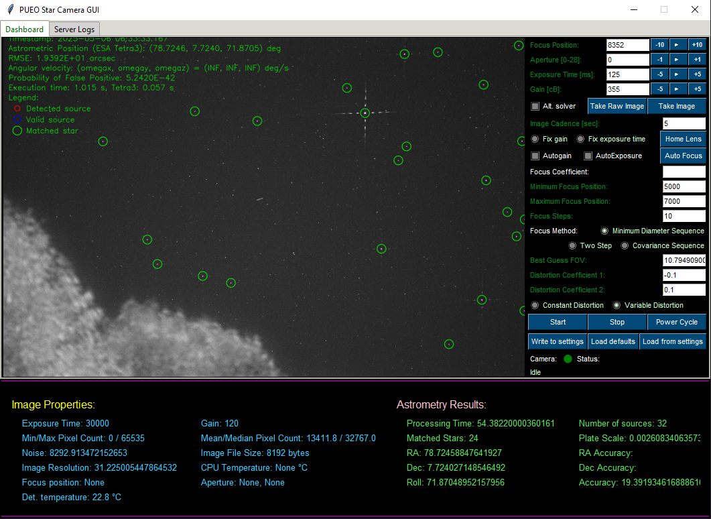

# PUEO Star Tracker Server 

Python-based server for autonomous star tracking, hardware control, and multi-client management. Handles camera/focuser operations, flight computer integration, and telemetry collection.

## Key Features
- **Multi-interface Control**
  - Camera (ZWO ASI/FLIR) & focuser (RPi/Arduino) management
  - Flight computer communication (UART/TCP)
  - Telemetry integration (Arduino sensors)
- **Network Services**
  - Concurrent client connections (GUI + API)
  - Telemetry streaming (WebSocket/HTTP)
- **Core Functions**
  - Real-time astro solving using ESA tetra3 or Cedar tetra3

## Hardware Support
| Component       | Interface          | Notes                      |
|-----------------|--------------------|----------------------------|
| Cameras         | ASI SDK, libcamera | ZWO/FLIR/RPi support       |
| Focusers        | Serial/GPIO        | Stepper & DC motor control |
| Flight Computer | WebSocket (JSON)   | Astro solutions/telemetry  |
| Arduino Sensors | I2C/Serial         | Thermal/IMU telemetry      |

## Installation
```bash
git clone https://github.com/windell747/star_tracker.git
cd star_tracker
pip install -r requirements.txt
```

## Configuration
Edit ```conf/config.ini```:

## Usage

```bash
source .venv/bin/activate
python3 pueo_star_camera_operation_code.py
# or just use existing run.sh
```

## System Diagram
graph TD
    A[PUEO Star Tracker Server] --> B[Camera Control]
    A --> C[Focuser Control]
    A --> D[Flight Computer]
    A --> E[Telemetry Arduino]
    A --> F[Client GUIs]

## Related Projects
[PUEO Star Tracker GUI](https://github.com/windell747/star_tracker_gui) - Control interface