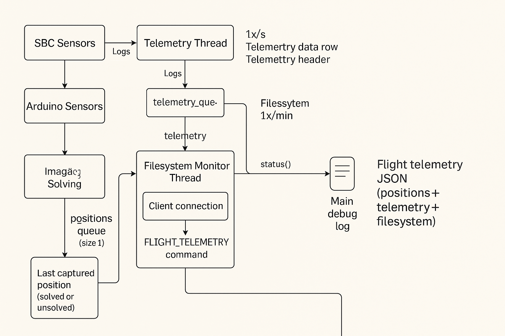
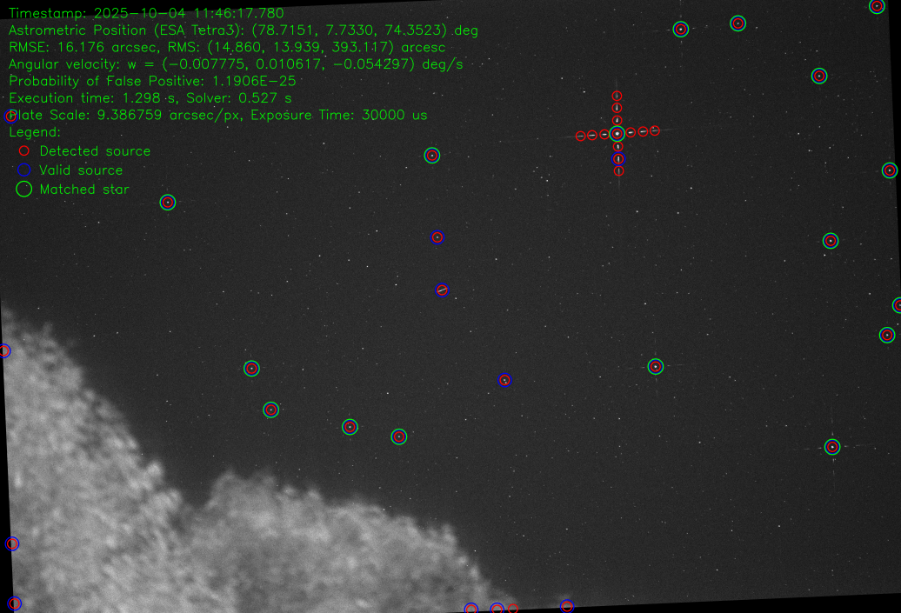

# 3.2.6 Software and Data — PUEO Star Tracker (Software ICD)

**Version:** 1.0  
**Generated:** 2025-10-07  
**Contact:** Milan Stubljar <info@stubljar.com>  

> This document (pueo_sw_icd.md) is the Software & Data subsection intended to be embedded into the ICD.  
> It focuses on the PUEO onboard SBC software, behavior, data formats, operator commands, and monitoring.  
> Figures (referenced below) must be placed alongside this markdown at the same relative path in the ICD package:  
> - `docs/Figure_PUEO_Telemetry_Architecture.png`  
> - `docs/Figure_PUEO_Final_overlay_image.png`

---

## 3.2.6.1 Overview (Scope)
This section documents the software components running on the onboard Single Board Computer (SBC), the data they produce and exchange, and the operator/flight-computer interfaces used during mission operations. The mechanical/physical purpose and high-level system description exist elsewhere in the ICD and are not repeated here. This document strictly addresses software, data, and operational interfaces.

Key high-level points (no repetition of main ICD):
- Primary on-board task: repeatedly capture images, detect star centroids, solve for astro position, and provide the latest solution to the flight computer via a local socket API (via command: flight_telemetry) or logs/astro.json file.  
- Secondary on-board tasks: telemetry acquisition (temperatures, CPU loads), filesystem monitoring, image serving for operator inspection, and local logging/archiving.
- Operator control is CLI-first: `pc.sh` wrapper and `pueo-cli.py` are the canonical operator interface. The web server only serves files (directory listing) and is *not* an interactive GUI.
- The flight computer consumes the `flight_telemetry` JSON via TCP (default port 5555) to obtain `position`, `telemetry`, and `filesystem` sections. Astro `position` is the primary payload.

---

## 3.2.6.2 Software Components (Roles & Responsibilities)

### Main server — `PueoStarCameraOperation` (Python)
- Language: Python 3 (virtualenv `.venv` used).
- Responsibilities:
  - Manage capture cadence and camera control (ASI camera via `lib/camera.py`).
  - Control focuser via serial or via serial over USB (`lib/focuser.py`) for autofocus/autogain sequences.
  - Run star-detection and astrometry solving (three solver options supported).
  - Collect telemetry (from local SBC sensors and Arduino temperature sensors) and write telemetry rows to `logs/telemetry.log`.
  - Maintain `positions_queue` and `telemetry_queue` (DroppingQueue, typically `maxsize=fq_max_size` from `conf/config.ini`). These store the latest (most recent) entries for API consumption.
  - Initialize and supervise support components: `Compute`, `FSMonitor`, `Astrometry`, `VersaAPI`, `Telemetry`, and `StarCommBridge` (server bridge).

**Threads and processes**:
- Main thread – runs core capture/solve loop and state machine.
- Telemetry thread – reads sensors & Arduino at ~1 Hz and logs to telemetry log and queue.
- Server thread (StarCommBridge.start_server) – accepts TCP client connections and spawns handler threads for each client.
- Monitor thread – FSMonitor, runs periodic filesystem checks and maintains time-series snapshots and trend forecasts.
- Optional pool: `multiprocessing.Pool` used for parallel CPU-bound work (configurable `max_processes`).

### StarCommBridge (Server thread)
- Listens on configured `pueo_server_ip` and `port` (default `0.0.0.0:5555`). Accepts client connections; each client handled in its own thread.
- Exposes the socket-based JSON command API (see Section 3.2.6.4 API/CLI). Implements `flight_telemetry` request by collecting latest `positions_queue`, `telemetry_queue`, and a snapshot from `FSMonitor`.
- Uses `DroppingQueue.get_all(limit)` semantics to produce results. Default `fq_max_size=1` implies only the LAST solution/telemetry is retained by default.

### Cedar Detect Server
- Cedar detect is distributed and installed as part of the PUEO distribution. It provides the Cedar-based detection server (gRPC-like interface) used by `solver2` detection.
- Usually launched by the startup script (see 3.2.6.3) and runs as a separate process (`cedar-detect-server` binary).

### Web server (static file server)
- Simple Python HTTP server that serves the `web/` directory; exposes latest files (e.g., `astro.json`, `last_final_overlay_image_downscaled.png`, `last_inspection_image.jpg`, `last_info_file.txt`).
- Not an interactive GUI; intended for read-only access on the local intranet or via SSH port-forwarding if required.

### FSMonitor (Filesystem monitor)
- Periodically checks configured paths (root, ssd, sd_card) and stores time-windowed snapshots used for trend forecasting and capacity warnings. Switches to preflight when critical level of free space is reached on any of the root/sd_card/ssd.
- Exposes a `status()` call used to populate `filesystem` in `flight_telemetry` output.

### Telemetry (Sensors + Arduino)
- Scans local hardware sensors (linux sensor adapters) and reads Arduino DS18B20 temperature sensors via USB (when present).
- Writes a human- and spreadsheet-friendly telemetry log (`logs/telemetry.log`) where each row contains a timestamp and sensor values. Headers are periodically logged to enable easy import into Excel/CSV viewers for post-processing.
- Telemetry entries are enqueued into `telemetry_queue` for inclusion in `flight_telemetry` responses.

### Astrometry & Solvers
- Two-stage pipeline: **Detect** (centroid extraction) → **Solve** (match centroids to sky catalog using solver). Supported solve paths:
  - `solver1`: Custom detection + ESA Tetra3 (lib/tetra3.py)
  - `solver2`: Cedar Detect (external server) + Cedar Tetra3 (lib/cedar/tetra3.py)
  - `solver3`: Custom detection + Astrometry.net (CLI) — results normalized to the same data structure as other solvers.

---

## 3.2.6.3 Startup and Shutdown Procedures

### Autostart / Startup mechanism
- System startup uses `~/scripts/startup_commands.sh` (example below). This script starts three processes and writes PIDs to `~/Projects/pcc/logs/*.pid`:
  - Cedar detect server (`cedar-detect-server`)
  - PUEO server (Python `pueo_star_camera_operation_code.py`)
  - Python HTTP server (static file listing on `WEB_PORT=8000`), entry url: http://localhost:8000
- Example (extracted, canonicalized):
```bash
# ~/scripts/startup_commands.sh
.venv/bin/python pueo_star_camera_operation_code.py > ~/Projects/pcc/logs/pueo_console.log 2>&1 &
~/Projects/pcc/lib/cedar_detect/target/release/cedar-detect-server > ~/Projects/pcc/logs/cedar_console.log 2>&1 &
.venv/bin/python -m http.server "$WEB_PORT" --directory "$WEB_DIRECTORY" > ~/Projects/pcc/logs/web_console.log 2>&1 &

# store pids:
echo "$CEDAR_PID" > ~/Projects/pcc/logs/cedar.pid
echo "$PUEO_PID" > ~/Projects/pcc/logs/pueo.pid
echo "$WEB_PID" > ~/Projects/pcc/logs/web.pid
```

- Example execution (canonical output from ./status.sh restart):
```bash
(.venv) pst@erintest:~/Projects/pcc/logs$ ./status.sh restart
Stopping services (delay: 2s)...
  CEDAR Detect: Terminated PIDs: 2482349
  PUEO Server: Terminated PIDs: 2482352
2482919
  WEB Server: Terminated PIDs: 2482355
Starting services...
  Executed: /home/pst/scripts/startup_commands.sh
Waiting 5s for servers to initialize...

Final Status:
=== System Status ===
VL Driver: Not Installed
VL Install: Not Configured
CEDAR Detect: Running (PIDs: 2493336)
PUEO Server: Running (PIDs: 2493340)
WEB Server: Running (PIDs: 2493343)
```

- Example execution (canonical output from `./status.sh restart`):

```bash
(.venv) pst@erintest:~/Projects/pcc/logs$ ./status.sh restart
Stopping services (delay: 2s)...
  CEDAR Detect: Terminated PIDs: 2482349
  PUEO Server: Terminated PIDs: 2482352
2482919
  WEB Server: Terminated PIDs: 2482355
Starting services...
  Executed: /home/pst/scripts/startup_commands.sh
Waiting 5s for servers to initialize...

Final Status:
=== System Status ===
VL Driver: Not Installed
VL Install: Not Configured
CEDAR Detect: Running (PIDs: 2493336)
PUEO Server: Running (PIDs: 2493340)
WEB Server: Running (PIDs: 2493343)
```

- Upon successful startup, the `~/Projects/pcc/logs/` folder contains:

  - Console logs: `pueo_console.log`, `cedar_console.log`, `web_console.log`
  - PID files: `pueo.pid`, `cedar.pid`, `web.pid`
  -`startup.log` entries that confirm the executed commands and PIDs, useful for auditing and troubleshooting.

### Order and rationale
1. Start Cedar Detect server first (detection service available for early test images).  
2. Start PUEO main server (initializes camera, focuser, telemetry, FSMonitor).  
3. Start web static file server last (relies on file tree created by main server).

This order is the same used by the project's `startup_commands.sh` to avoid race conditions where Pueo might attempt to use a detection service that hasn't yet bound to its port.

### Shutdown
- Use the `status.sh shutdown` wrapper (part of `~/Projects/pcc/logs/status.sh`) which will:
  - Stop Cedar Detect, PUEO server, and Web server processes by matching running process patterns (`pgrep -f`).
  - Write termination results to console output and log summary.
  - Optionally power off the SBC when the `shutdown` option is invoked.
- Manual shutdown sequence (graceful):
  1. `./pc.sh stop` (stop autonomous capture)
  2. Terminate/kill Cedar Detect, PUEO Server, Web server processes (via pid or `status.sh stop`)
  3. OS `sudo shutdown -h now` if needed

> Note: `status.sh` supports `status`, `start`, `stop`, `restart`, and `shutdown`. It both logs and prints status and will report PIDs for the expected processes.

### Pre-Mission Cleanup Utilities

Prior to each mission or qualification test, operators should perform a **system cleanup** to ensure that all telemetry, log, and image directories start from a known, empty state.  
These tools remove residual data from previous runs and help maintain a consistent, traceable environment for telemetry and image processing.

⚠️ **Warning:** Cleanup operations permanently delete files. Confirm that all critical mission or test data have been archived before running any cleanup script.

---

#### 1. Log Cleanup Script

**Path:** `~/Projects/pcc/logs/cleanup.sh`  
**Purpose:** Quickly clears logs and process tracking files.  
Removes all `.pid` files, console logs, telemetry logs, debug logs, and the `test_logs/` directory.

**Usage Example:**
```bash
cd ~/Projects/pcc/logs
./cleanup.sh
````

This command resets the logging environment and is typically used:
 
* Immediately before system startup (mission initialization)
* After partial test runs or aborted operations
  Result: the log directory is completely cleared and ready for new mission data.

---

#### 2. Data Cleanup Script

**Path:** `~/Projects/pcc/logs/cleanup_data.sh`
**Purpose:** Performs a **comprehensive data wipe**, including image and log directories.
Targets all linked storage locations:

* `autogain/`
* `ssd_path/`
* `sd_card_path/`
* `output/`

It also clears all log files and PID files in `~/Projects/pcc/logs/`.

Before deletion, the script:

* Displays the resolved physical paths of each target directory
* Issues a **visual terminal warning** (colored output)
* Requests confirmation (`ARE YOU SURE YOU WANT TO DELETE ALL THIS DATA? (y/n)`)

**Usage Example:**

```bash
cd ~/Projects/pcc/logs
./cleanup_data.sh
```

Upon completion, it reports:

* The number of deleted items
* Remaining free space on SSD (`/mnt/raid1/`) and SD card (`/mnt/sdcard/`)

This cleanup should be used **only before mission deployment or after full data extraction**, when all imagery and logs have been secured.

---

#### 3. Recommended Pre-Mission Preparation Sequence

1. **Stop all services**

   ```bash
   ./status.sh stop
   ```
2. **Perform a log-only cleanup**

   ```bash
   ./cleanup.sh
   ```
3. **(Optional) Execute full data cleanup**

   ```bash
   ./cleanup_data.sh
   ```
4. **Restart system services**

   ```bash
   ./status.sh restart
   ```

This ensures that the system, logs, and telemetry start from a controlled and reproducible baseline.

---

#### 4. Operator Script Summary

| Script Name           | Path                   | Function Summary                                  | Typical Use Case                           |
| --------------------- | ---------------------- | ------------------------------------------------- | ------------------------------------------ |
| `startup_commands.sh` | `~/scripts/`           | Starts PUEO, Cedar Detect, and Web servers        | System startup                             |
| `status.sh`           | `~/Projects/pcc/logs/` | Stops, restarts, or checks service status         | Runtime management                         |
| `cleanup.sh`          | `~/Projects/pcc/logs/` | Clears logs, telemetry, and PID files             | Routine pre-mission cleanup                |
| `cleanup_data.sh`     | `~/Projects/pcc/logs/` | Full data wipe (logs, images, SSD/SD card output) | Full system reset / pre-flight preparation |

---

**Cross-Reference:**
For details on log file formats, retention behavior, and monitoring, see **Section 3.2.6.5 – Logging and Monitoring**.
Consistent use of cleanup utilities ensures that log and telemetry systems operate from a fresh baseline, improving reliability and traceability during mission operations.

---

## 3.2.6.4 Operator Interfaces (CLI / API)

### CLI (primary operator interface)
- The canonical operator tool is `pueo-cli.py` with wrapper `pc.sh`. CLI commands **are authoritative** for operator workflows. The CLI translates human-friendly commands into JSON messages and sends them to the Pueo server (TCP socket).
- All CLI commands and options are available in `docs/pueo_cli.md`. The ICD includes the full command summary table below (derived and refactored from `pueo_cli.md`). 

#### Summary table — common CLI commands (short-form)
| Category | Command (pc.sh / pueo-cli.py) | Action |
|---|---:|---|
| System | `./pc.sh start [solver] [cadence]` | Start/resume autonomous image capture |
| System | `./pc.sh stop` | Stop autonomous mode |
| System | `./pc.sh power_cycle` | Power-cycle camera and focuser |
| Focus | `./pc.sh home_lens` | Home focuser |
| Focus | `./pc.sh check_lens` | Focuser check (use after stopping autonomous) |
| Focus | `./pc.sh auto_focus [start stop step autogain]` | Run autofocus routine |
| Camera | `./pc.sh auto_gain [value]` | Run autogain routine |
| Camera | `./pc.sh auto_exposure [value]` | Run autoexposure routine |
| Camera | `./pc.sh take_image [type]` | Capture one image (type: raw, solver1, solver2, solver3) |
| Camera | `./pc.sh set_exposure <us>` | Set exposure time (microseconds) |
| Camera | `./pc.sh set_gain <value>` | Set camera gain |
| Camera | `./pc.sh set_focus <pos>` | Set focuser absolute position |
| Mode | `./pc.sh set_flight_mode <preflight|flight>` | Set flight mode (preflight: images not saved) |
| Mode | `./pc.sh set_chamber_mode <True|False>` | Enable/disable chamber mode (test images) |
| Info | `./pc.sh get_status` | Retrieve system status summary |
| Info | `./pc.sh get_settings` | Fetch current camera and system settings |
| Telemetry | `./pc.sh get_flight_telemetry [limit] [metadata]` | Get flight telemetry (positions, telemetry, filesystem) |

> Full command help: `python pueo_cli.py --full-help` or `./pc.sh <command> --help`. Each execution prints the exact JSON payload sent to the server (operator-visible). See `docs/pueo_cli.md` for full examples and canonical outputs.

**Important operator notes:**
- None of the operating commands require elevated privileges (root or sudo).
- Long-running commands (autofocus, autoexposure, autogain) may exceed default socket timeouts; CLI displays timeout warnings when they occur but continues the execution.

### Socket API — Flight computer integration
- Transport: TCP JSON messages over socket (newline-terminated). Default address `127.0.0.1:5555` or remote `pueo_server_ip` as configured.
- Example via `nc`:
```bash
echo '{"command":"flight_telemetry","data":{"limit":1}}' | nc localhost 5555
```
- `StarCommBridge` responds with JSON using the `Status` wrapper: `{"error_code":0, "error_message":"Idle", "data": {...}}` on success.

#### `flight_telemetry` payload (high-level)
- Request data keys: `limit` (int, 0 = all since last call), `metadata` (bool). Default `limit=0` returns all available stored entries; with `fq_max_size=1` this normally returns latest only (default).
- Response `data` includes:
  - `mode` – current flight mode
  - `position` – object `{timestamp, size, data: [ position_entries ... ]}` where each position entry includes `timestamp`, `solver`, `astro_position` [RA,Dec,Roll], `FOV`, `RMSE`, `RMS`, `sources`, `matched_stars`, `probability`, `angular_velocity`.
  - `telemetry` – object similar to `position`, containing timestamped sensor rows (as arrays) with `headers` describing columns.
  - `filesystem` – snapshot returned by `FSMonitor.status()` describing `root`, `ssd`, `sd_card` with usage percentages, trends and forecasts.
- Position is the primary, critical payload for the flight computer; telemetry/filesystem are supportive situational-awareness data.

> Example outputs and full JSON structures are documented in `docs/pueo_api.md` and included in the ICD appendix for exact field names and example content.

---

## 3.2.6.5 Logging and Monitoring

### Log Files & Locations (Canonical)

- **Project root:** `~/Projects/pcc`  
- **Logs directory:** `~/Projects/pcc/logs/`

| Purpose                | File (Example)                      | Rotation / Retention Policy |
|------------------------|-------------------------------------|-----------------------------|
| Main server console    | `logs/pueo_console.log`             | Logrotate – 128 MB × 10 backups (hourly cron) |
| Cedar detect console   | `logs/cedar_console.log`            | Logrotate – 128 MB × 10 backups (hourly cron) |
| Web server console     | `logs/web_console.log`              | Logrotate – 128 MB × 10 backups (hourly cron) |
| Rotating debug log     | `logs/debug-server.log`             | Python logging – 16 MB × 10 backups |
| Rotating telemetry log | `logs/telemetry.log`                | Python logging – 16 MB × 96 backups |
| PID files              | `logs/pueo.pid`, `logs/cedar.pid`, `logs/web.pid` | Non-rotated, overwritten on startup |

---

All primary logs are handled by the **Python logging framework**, which maintains rolling files with fixed size limits and backup counts.  
Console logs (`*_console.log`) are managed separately through **system-level logrotate** configuration, ensuring clean hourly rotation and compression of large files.  
This dual-layer strategy guarantees both detailed runtime visibility and controlled disk utilization during extended operations.

---

**Cross-Reference:**  
See also *Section 3.2.6.3 – Pre-Mission Cleanup Utilities* for details on resetting and purging all log files prior to mission start.


### Logging formats & rotation
- Application logs: human-readable time-prefixed lines with module, level and message. Rotating file logging used (max file size and backup counts present in logging initializer).
- Telemetry log is intentionally CSV-like with periodic header rows and a timestamp in the first field of each data row to facilitate Excel import. Example telemetry lines (abridged), the forecast becomes available when images are taken and space consumed generating a use trend, representing the time it will take to fill the target free space with the continual usage:
```
2025-09-09 01:38:37.699 1175971   488:                 log_data    INFO Telemetry header: acpitz_acpi_0_temp, coretemp_isa_0000_package_id_0_temp, ..., S1, S2, S3, S4, S5, S6
2025-09-09 01:38:37.699 1175971   490:                 log_data    INFO Telemetry data: 2025-09-09 01:38:34, acpitz-acpi-0, coretemp-isa-0000, 49.0 %, 50.0 %, 49.0 %, 42.3 %, 29.31 °C, 33.75 °C, 34.06 °C, 32.75 °C, 28.62 °C, 27.12 °C
```
- `debug-server.log` contains periodic FSMonitor summaries (one-line compact status) to provide quick operator readout:
```
INFO Status ssd: level=normal used=%82.07 folders=6 files=342 forecast={'critical': None, 'warning': None}
```

### Console redirection
- Startup script redirects service stdout/stderr to the console files shown earlier so operators can `tail -f logs/pueo_console.log` to follow bootstrap and runtime messages.

### Monitoring & Alerts
- FSMonitor provides warnings/critical when used disk percent crosses `warning_pct`/`critical_pct` thresholds configured in `conf/config.ini`. On crossing critical the server will transition to `preflight` mode on next take_image to limit storage usage.

---

## 3.2.6.6 Configuration Management

Primary config file: `conf/config.ini` (INI format). Key sections relevant to operations:
- `[GLOBAL]`, `[LOG]`, `[CAMERA]`, `[IMAGES]`, `[STAR_COMM_BRIDGE]`, `[FILESYSTEM_MONITOR]`, etc.
- Important parameters (examples):
  - `GENERAL.time_interval` — cadence (microseconds)
  - `GENERAL.run_autofocus`, `GENERAL.run_autonomous`, `GENERAL.run_telemetry`, `GENERAL.run_chamber`
  - `STAR_COMM_BRIDGE.port`, `STAR_COMM_BRIDGE.pueo_server_ip`, `STAR_COMM_BRIDGE.fq_max_size`
  - Filesystem thresholds: `FILESYSTEM_MONITOR.warning_pct`, `FILESYSTEM_MONITOR.critical_pct`
  - Camera/gain/exposure defaults: `lab_best_focus`, `lab_best_gain`, `lab_best_exposure`
- Operators should *not* routinely edit the config on flight units. Pre-flight configuration and validation is part of the test procedure. Any changes should be recorded and version-controlled (copy of `conf/config.ini` saved as `conf/config.ini.<YYYYMMDD>`).
- The **`conf/dynamic.ini`** (auto-created if non-existent) holds changed values making the restart of the server continue in the same state as prior restart. The values in `dynamic.ini` **override** the `config.ini` values. To start from scratch, **delete** `dynamic.ini` file; it will be recreated on startup.

  - The `conf/dynamic.ini` file stores the **current persistent operational state** of the server. It is updated every time a value is changed via the CLI. 
  - The system explicitly reports the dynamic values that are overriding defaults in `config.ini` every time a command is invoked using the CLI tool, as seen in the output of a command like `./pc.sh get_status`:

    ```bash
    st@erintest:~/Projects/pcc$ ./pc.sh get_status
    pueo-cli v1.0.0
    Reading config file: conf/config.ini
    Loading dynamic file: conf/dynamic.ini
      Updating config values (from dynamic):
                  lab_best_focus <- 8352  # Dynamic value overriding config.ini default
                    level_filter <- 9
                       flight_mode <- flight
                          solver <- solver3
                   time_interval <- 1000000
                       run_chamber <- True
    INFO: Connected to server at 127.0.0.1:5555
    ...
    ```

    **Example Contents of `conf/dynamic.ini`**
    
    ```ini
    [DYNAMIC]
    lab_best_aperture_position = 0
    lab_best_focus = 8353
    lab_best_gain = 120
    lab_best_exposure = 100000
    level_filter = 36
    flight_mode = flight
    solver = solver1
    time_interval = 5000000
    run_autonomous = False
    run_chamber = False
    angular_velocity_timeout = 10.0
    current_timeout = 200.0
    ```

Environment:
- `env_filename` points to ASI SDK library for camera control. Must be valid on SBC and not on Windows-development machines.
- Paths such as `ssd_path`, `sd_card_path`, `output` are expected to be symlinked to the mission storage (see installation snippet below).

**Installation symlink snippet (canonical)**:
```bash
# run on the SBC to create project link layout (example)
cd ~/Projects/pcc
ln -s /mnt/ssd1/pueo_images_final output
ln -s /mnt/ssd1/pueo_images_raw ssd_path
ln -s /mnt/ssd1/pueo_autogain autogain
ln -s /mnt/sdcard1/pueo_images_ds sd_card_path
```

---

## 3.2.6.7 Data Handling

### Image file types and storage locations
- Raw images (full resolution) → `ssd_path/` daily subfolder: `RAW` filenames example:  
  `251004_114533.196512-raw.png` (+ companion `log_251004_114533.196512.txt`)  
- Final solved overlay images → `output/` (SSD final) daily subfolder as:  
  `Final_overlay_image_251004_114533.196512-raw_251004_114533.196512_downscaled.png`  
- SD card (downscaled) → `sd_card_path/` daily subfolder: as:  
  `251004_114533.196512-raw-ds.png` (+ `log_251004_114533.196512.txt`)  
- Autogain / autofocus images → `autogain/{timestamp_string}_.../` subfolders (see `conf/paths`).
- Web directory links to latest files (one-file symlink names used by web listing):
  - `astro.json` → logs/astro.json, last astro position
  - `last_final_overlay_image_downscaled.png` → points to latest overlay downscaled image
  - `last_inspection_image.jpg` → latest inspection image
  - `last_info_file.txt` → latest info file

### Naming convention summary (recommended canonical names)
- Raw: `YYMMDD_HHMMSS.mmmmmm-raw.png` with accompanying `log_YYMMDD_HHMMSS.mmmmmm.txt` (info file)
- Downscaled SD: `YYMMDD_HHMMSS.mmmmmm-raw-ds.png`
- Final overlay: `Final_overlay_image_YYMMDD_HHMMSS.mmmmmm-raw_YYMMDD_HHMMSS.mmmmmm_downscaled.png`
- Overlay companion log: `log_YYMMDD_HHMMSS.mmmmmm.txt`


### Info / log file contents (per-image)
- Each captured image has a textual info file describing camera parameters, background statistics, centroid list, and astrometry solution when available. Example excerpt (canonical):
```
Image type : Single standard operating image
system timestamp : 1759578377.780025
exposure time (us) : 30000
gain (cB) : 120
...
Astrometry:
RA: 78.71505640748816
Dec: 7.733001101559041
Roll: 74.35232782212758
FOV: 10.805202876390073
RMSE: 16.176042832890854
Matches: 17
Prob: 1.1905907595908818e-25
...
```
- Companion logs include matched centroid arrays and solver profiling (solver time, total exec time, body rotation rate if available).

### Flight Telemetry JSON (position prioritized)
- Position structure (one example position element):
```json
{
  "timestamp":"2025-04-22T16:45:38.727641",
  "solver":"solver2",
  "solver_name":"Cedar Tetra3",
  "astro_position":[78.7234,7.7124,71.8304],
  "FOV":10.8046,
  "RMSE":14.2505,
  "RMS":[19492.2193,107.5153,646769.7753],
  "sources":30,
  "matched_stars":18,
  "probability":2.446e-22,
  "angular_velocity":[null,null,null]
}
```
- Telemetry JSON and filesystem JSON follow the examples in `docs/pueo_api.md`. Position is treated as the primary element for flight computers.

---

## 3.2.6.8 Error Handling and Troubleshooting

### Common problems & operator steps
1. **No camera detected at startup**  
   - Symptom: log: `No cameras found. Exiting` (then dummy mode).  
   - Action: Verify camera USB connection, ASI SDK `env_filename` path, run `lsusb` (SBC), check permissions, restart via `status.sh restart`.
2. **Cedar detect unavailable**  
   - Symptom: PUEO solve using solver2 fails or delays.  
   - Action: Check `logs/cedar_console.log` and `~/Projects/pcc/logs/cedar.pid`. Start cedar manually if needed; ensure `startup_commands.sh` uses the production binary path.  
3. **Telemetry Arduino serial not found**  
   - Symptom: `Failed to connect to serial port: ...` and warning about dummy serial.  
   - Action: Verify `telemetry_port` in config.ini (use `by-id` stable path), confirm Arduino is enumerated and available at the specified path. Telemetry will still run with SBC sensors if Arduino absent.
4. **Filesystem approaching critical usage**  
   - Symptom: FSMonitor warns `used_pct >= warning_pct` and later `>= critical_pct`.  
   - Action: Free space or set `run_chamber = False` and `flight_mode = preflight` to avoid saving images. On critical, server will transition to `preflight` on next take_image.
5. **Socket timeouts for long ops**  
   - Symptom: CLI shows "Server response timed out" for autofocus/autoexposure.  
   - Action: Monitor server logs to verify completion.

### Debugging tips
- `tail -f logs/debug-server.log` — watch PUEO server, FSMonitor, telemetry, focuser, camera and solver messages.  
- `tail -f logs/pueo_console.log` — watch startup console and runtime messages - more operator friendly high level messages and details.  
- Use the CLI `./pc.sh get_settings` to confirm runtime config and status. The CLI prints the JSON sent and server responses for traceability.  
- Use the CLI `./pc.sh get_status` to confirm runtime status. The CLI prints the JSON sent and server responses for traceability.
- Check PID files at `logs/*.pid` to identify running processes and use `ps`/`kill` for manual control.
- Use the status command `./logs/status.sh` to view status of the running server processes.

---

## 3.2.6.9 Security and Access Control (Operational Guidance)
- Access model: SBC is on the instrument local intranet. Operators connect via SSH to the SBC account `pst` (standard operator account). Flight computer connections are local to the SBC network interface. The environment is isolated; for ICD purposes the recommended minimal controls are described below:
  - Limit physical access to SBC and instrument network for mission systems.
  - Use SSH with key-based auth for remote operator access where policy requires it.
  - Configure firewall to restrict TCP 5555 to the local network or loopback (if flight computer is local).
  - CLI commands are not authenticated beyond process-level OS permissions; therefore restrict user accounts and lock down OS access on flight units.
- For the current mission baseline, the system operates in an isolated environment and simple local user controls are acceptable; for any deployment with external network connectivity, apply standard network hardening and access control policies.

---

## 3.2.6.10 References (github)
- `docs/cheetsheet.md` — Cheatsheets (operational quick guides & examples).  
- `docs/pueo_api.md` — PUEO Star Tracker API Specification (flight_telemetry, flight_mode, etc.).  
- `docs/pueo_cli.md` — Full CLI reference (commands, examples, timeouts, error cases).  
- `docs/pueo_integration_guide.md` — Integration patterns (socket and serial) and Python client example.  
- `conf/config.ini` — Canonical configuration file (included in project).  
- `scripts/startup_commands.sh` — Startup script used by `logs/status.sh start`.  
- `docs/Figure_PUEO_Telemetry_Architecture.png` — Telemetry architecture diagram (include in ICD).  
- `docs/Figure_PUEO_Final_overlay_image.png` — Example final overlay image (include in ICD).

---

## Appendix A — Useful examples (copy-friendly)

### Example: `flight_telemetry` request (via netcat)
```bash
echo -e '{"command": "flight_telemetry", "data": {"limit": 1}} \n' | nc -v localhost 5555
```

### Example: `flight_telemetry` response (abridged)
```json
{
  "error_code": 0,
  "error_message": "Idle",
  "data": {
    "mode": "flight",
    "position": {
      "timestamp": "2025-04-22T16:45:43.617632",
      "size": 1,
      "data": [
        {
          "timestamp": "2025-04-22T16:45:38.727641",
          "solver": "solver2",
          "astro_position": [78.7234, 7.7124, 71.8304],
          "FOV": 10.8046,
          "RMSE": 14.2505,
          "sources": 30,
          "matched_stars": 18
        }
      ]
    },
    "telemetry": {
      "timestamp": "2025-04-22T16:45:43.617632",
      "size": 1,
      "data": [
        {
          "timestamp": "2025-04-22 16:45:41",
          "headers": [
            "drivetemp_scsi_0_0_temp",
            "acpitz_acpi_0_temp",
            "drivetemp_scsi_1_0_temp",
            "coretemp_isa_0000_package_id_0_temp",
            "coretemp_isa_0000_core_0_temp",
            "coretemp_isa_0000_core_1_temp",
            "coretemp_isa_0000_core_2_temp",
            "coretemp_isa_0000_core_3_temp",
            "core0_load",
            "core1_load",
            "core2_load",
            "core3_load",
            "core4_load",
            "core5_load",
            "core6_load",
            "core7_load",
            "S1",
            "S2",
            "S3",
            "S4",
            "S5",
            "S6",
            "S7",
            "S8",
            "S9",
            "S10"
          ],
          "data": [
            "28.0 °C",
            "29.0 °C",
            "27.0 °C",
            "30.0 °C",
            "29.0 °C",
            "30.0 °C",
            "29.0 °C",
            "29.0 °C",
            "84.5 %",
            "73.8 %",
            "81.5 %",
            "81.2 %",
            "81.5 %",
            "80.0 %",
            "83.3 %",
            "84.6 %",
            "97.95 °C",
            "70.51 °C",
            "62.54 °C",
            "93.0 °C",
            "74.45 °C",
            "60.31 °C",
            "20.71 °C",
            "36.55 °C",
            "76.88 °C",
            "36.12 °C"
          ]
        }
      ]
    },
    "filesystem": {
      "timestamp": "2025-10-06T22:43:01.702627",
      "size": 1,
      "data": [ { "root": {...}, "ssd": {...}, "sd_card": {...} } ]
    }
  }
}
```

### Example telemetry log excerpt (one-second cadence)
```
2025-09-09 01:38:37.699 1175971   488:                 log_data    INFO Telemetry header: acpitz_acpi_0_temp, coretemp_isa_0000_package_id_0_temp, ..., S1, S2, S3, S4, S5, S6
2025-09-09 01:38:37.699 1175971   490:                 log_data    INFO Telemetry data: 2025-09-09 01:38:34, acpitz-acpi-0, coretemp-isa-0000, 49.0 %, 50.0 %, 49.0 %, 42.3 %, 29.31 °C, 33.75 °C, 34.06 °C, 32.75 °C, 28.62 °C, 27.12 °C
```

---

### Figures




---
